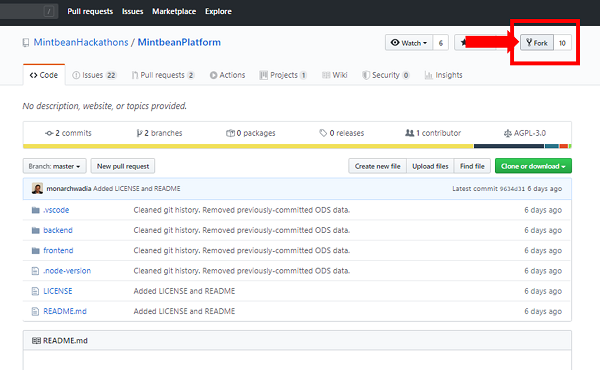
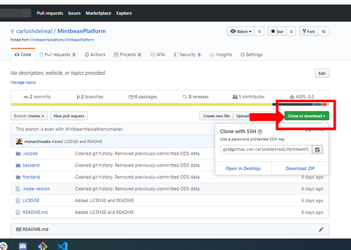

Welcome to the Mintbean platform. This project is what appears at [Mintbean.io](https://mintbean.io).

# Contributing

Contribution to the platform is open to all. Our community is supportive and friendly, and we welcome new participants in the software development process.

## How to contribute

Please take a look at the [Issues Tab](https://github.com/MintbeanHackathons/MintbeanPlatform/issues), which has clearly-marked labels for issues where help is wanted and issues which are a good starting point for new contributors. 

**IMPORTANT**: Please get in touch with Monarch before starting any work. See "How to get in touch" section below.

## Benefits of contributing

When you're looking for a job, recruiters and talent acquisition have their eyes peeled for open source contributions. If you can prove you have contributed to open source, then that is a signal that you are passionate and skillful in software development.

We will be publicly displaying the names of contributors on our website. This is an excellent way to add Open Source contributions to your resumes and portfolios, and a way which is very easily verifiable by potential employers.

# How to get in touch

This project is managed by [Monarch Wadia](https://github.com/monarchwadia). In order to contribute, please contact him via one of the following means:

* [LinkedIn](https://linkedin.com/in/monarchwadia)
* [Twitter](https://twitter.com/monarchwadia)
* [Issues Tab](https://github.com/MintbeanHackathons/MintbeanPlatform/issues) - create an issue or leave a comment on an existing issue.

Contributing to the platform is as easy as forking this project, then opening a pull request.

### About Mintbean

Mintbean is a software developer talent incubator. We work to accelerate the careers, skillsets, and professional networks of software developers globally.

# How to get Started

If you want to contribute to the styling, the content or add some new feature here is where you have to start. In this project we are Using [Vue.js](https://vuejs.org/) to build the frontend and [hapi](https://hapi.dev/) for the backend.

## Frontend

To get a developer environment of the frontend you have to have previously installed [node.js](https://nodejs.org/) then you have to fork this repository 



Then clone your own fork of the repo, notice that at the header of your repo says forked from MintbeanHackathons. Copy the **clone or download** link, If you have not configured an ssh key click on use HTTPS and copy the link.



Open a terminal or cmd and put 

```bash
git clone <your clone or download link>

```
Then navigate to the MintbeanPlatform/frontend folder by

```bash
cd MintbeanPlatform/frontend
```

And install the node packages by

```bash
npm install
```

Once all the dependencies have been installed type

```bash
npm run serve
```

open your browser and go to the http://localhost:8080/ path

voila!! you will see the frontend project running on your local machine

### I don't know Vue.js

Vue.js is one of the most popular frontend technologies, super intuitive and takes some of the best features from Angular and React. If you are not very familiar with this technology this is the opportunity to improve your skills. 

If you are experienced on other technologies such as React of Angular, to pickup the Vue.js components Idea it is not going to take you more than a tenth of working hours.

If you don't have much experience with JavaScript modern frameworks give it a try and you will be way more productive and capable of building amazing stuff.

### Vue.js Tutorials and Sources

If you have solid or at least decent JavaScript fundamentals I strongly recommend you this [Vue.js Step By Step Tutorial](https://laracasts.com/series/learn-vue-2-step-by-step).

You also can learn a lot from the [Official Vue Guide](https://vuejs.org/v2/guide/) and totally free. If you find another cool resource learn Vue, feel free to add it to this guide.

## Backend

To get a developer environment of the backend you have to have installed [node.js](https://nodejs.org/) and [PostgreSQL](https://www.postgresql.org/). To install PostgreSQL I recommend you to follow this [PostgreSQL Tutorial](https://www.postgresqltutorial.com/install-postgresql/). Then you have to fork this repository 


Then clone your own fork of the repo, notice that at the header of your repo says forked from MintbeanHackathons. Copy the **clone or download** link, If you have not configured an ssh key click on use HTTPS and copy the link.


Open a terminal or cmd and put 

```bash
git clone <your clone or download link>

```
Then navigate to the `MintbeanPlatform/backend` folder by

```bash
cd MintbeanPlatform/backend
```
Now, inside of the backend folder install the node dependencies by typing

```bash
yarn install
```
or
```bash
npm run install
```

Before to continue **be sure** that you have installed PostgreSQL.

### Create postgresql user

Browse on your system and open the SQL shell (psql) or type

```bash
psql -U postgres
```
If you have opened the SQL shell it is going to ask for a Server [localhost], Database [postgres], Port [5432] and Username [postgres]. you can leave this values as default by skipping them just hitting enter, then is going to ask you for the *Password for user postgres* so as you have just installed postgresql on your system you have to remember the password.

Once you put your password and hit enter you are going to have an SQL shell similar to this.

```bash
postgres=#
```

To check the users that you have created you can put

```bash
postgres=#\du
```

To create the mintbean user that we are going to use for our backend just type the following and don't forget to put the semicolon at the end. 

```bash
postgres=#CREATE USER mintbean;
```

Once you have created the mintbean user you can check that it has been created by using the `\du` command.

Now you have to add the role of Create Database to our mintbean user. you can to do that by typing:

```bash
postgres=#ALTER USER mintbean CREATEDB;
```

Again, don't forget the semicolon. lastly you have to create a password to your mintbean user

```bash
postgres=#ALTER USER mintbean WITH PASSWORD 'mintbeanpass';
```


> Now That you have created a user with Create Database role and a password you are ready to come back to the backend console.

### Create the Database

Now type on the console inside of the backend folder

```bash
yarn sql
```

You will see a list of the available commands to interact with the database, to create the database use

```bash
yarn sequelize db:create
```
or
```bash
yarn sequelize-cli db:create
```
depending on you Operating System.

Now that you have created you database you have to populate it with the corresponding tables and relationships. that is achieved by using the migrate command.

```bash
yarn sequelize db:migrate
```

Then, if you want to have some data on the database to work with, just type

```bash
yarn sequelize db:seed:all
```

Now you are ready to see the backend working, but before of that let's check that we are using the correct username and password.

### Username, Password and Environment Variables

If you open the `backend/config/database.config.js` file you will see the username and password that the backend is going to use to connect to the database, now you will notice that you can change the user name *mintbean* to whatever you want but you have to create that user on your postgresql database as was shown.

In the other hand the password has been defined to an Environment Variable by `process.env.DB_PASSWORD`. To set properly the `DB_PASSWORD` variable you have to create or update the file `backend/.env` to contain the following two lines.

```
NODE_ENV=development
DB_PASSWORD=mintbeanpass
```
As you might suspect this two lines set your environment to be development and provide the password to access the database.

This technique is used to avoid hardcoding database passwords and what is worse to upload database passwords to public repositories.

Once you have follow this steps you might run the following command

```bash
yarn dev
```
And you will see your backend coming to life. now navigate to some of the API routes as [http://localhost:3000/api/v1/developer](http://localhost:3000/api/v1/developer). And you are ready to create the next coolest MintBean Hackathon's feature.


