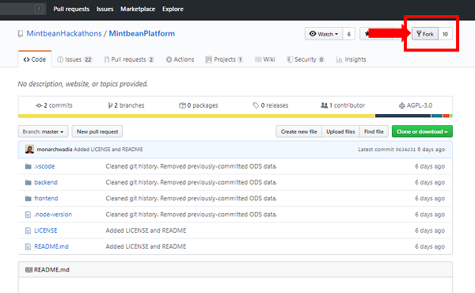
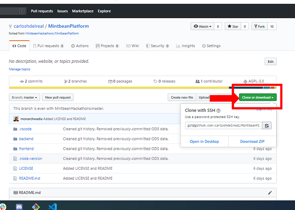

# Forking and cloning this repo

In order to contribute to this repo, you have to fork this repo, then clone your fork. 

Notice that at the header of your repo says forked from MintbeanHackathons. Copy the **clone or download** link, If you have not configured an ssh key click on use HTTPS and copy the link.

## Forking

Forking the repo is as easy as clicking a button.

## Cloning

Cloning the repo is also simple. Please make sure you are cloning a fork of the original repo. You will know your repo has been successfully cloned if you can see, in the header of your repo, a small link that says the repo is forked from MintbeanPlatform. 

Copy the **clone or download** link, If you have not configured an ssh key click on use HTTPS and copy the link.

